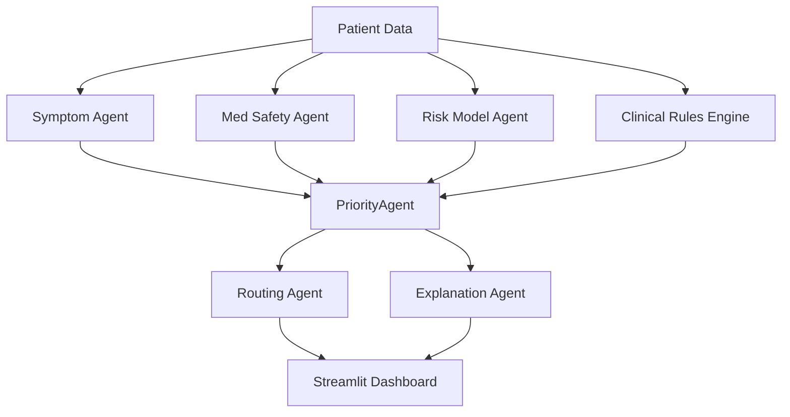

# Patient Safety Guardian

A fully local, multi-agent AI system for patient safety monitoring, risk prediction, and clinical decision support.

## 🏗️ Architecture



## 🚀 Quickstart

1.  **Install Dependencies**:
    ```bash
    pip install -r requirements.txt
    ```

2.  **Generate Synthetic Data**:
    ```bash
    python data_generator.py --n 1000 --realistic
    ```

3.  **Train Risk Model**:
    ```bash
    python train_model.py
    ```

4.  **Run Application**:
    ```bash
    streamlit run app.py
    ```

## 🩺 System Components

### 1. Multi-Agent Framework
-   **Symptom Agent**: Extracts symptoms from clinical notes using NLP.
-   **Medication Safety Agent**: Checks for drug-drug interactions against a curated knowledge base (>40 rules).
-   **Risk Agent**: Predicts deterioration risk using a calibrated Random Forest model.
-   **Priority Agent**: Determines triage priority based on risk, interactions, and symptoms.
-   **Routing Agent**: Assigns patients to appropriate clinical teams based on priority and specialty.
-   **Explanation Agent**: Generates human-readable clinical summaries.

### 2. Clinical Rules Engine
Deterministic rules run alongside ML models to catch critical conditions like:
-   Severe Hypotension
-   Hypoxemia
-   Sepsis (SIRS criteria)

### 3. Privacy & Safety
-   **Fully Local**: No data leaves the machine. No external API calls.
-   **Audit Trail**: All routing decisions and clinician actions are logged to `evidence/`.
-   **Deterministic**: Critical alerts are rule-based and always trigger when criteria are met.

## 📂 Project Structure

-   `app.py`: Main Streamlit dashboard.
-   `pipeline.py`: Orchestrator for batch processing.
-   `agents/`: Source code for all agents.
-   `data/`: Synthetic patient data and medication rules.
-   `models/`: Trained ML models.
-   `evidence/`: Logs, reports, and evaluation metrics.
-   `tests/`: Unit tests.

## 🚀 Deployment

See [DEPLOY.md](DEPLOY.md) for instructions on deploying to Streamlit Cloud or Docker.

## ⚠️ Disclaimer
This is a simulation for educational purposes only. Not for clinical use.
